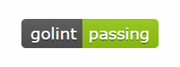
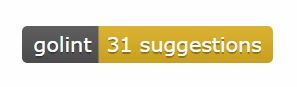
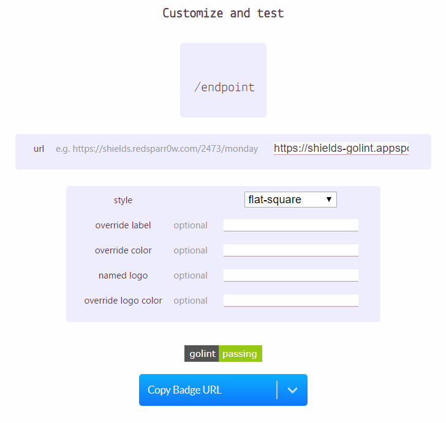

# shields-golint

The [Shields Endpoint](https://shields.io/endpoint/) for [http://go-lint.appspot.com/](http://go-lint.appspot.com/).

## Examples

Passing:

Error:

## Usage

### 1. Create endpoint URL for your repository.

Concatinate the import path after `https://shields-golint.appspot.com/`.

e.g. `https://shields-golint.appspot.com/github.com/acomagu/shields-golint`

### 2. Get badge URL.

Visit [shields.io/endpoint](https://shields.io/endpoint) and paste the URL.

Then click "Copy Badge URL" button.

## How to setup own endpoint server 

### Requirements

- Go 1.12 or above.

### Environment variables

- PORT
